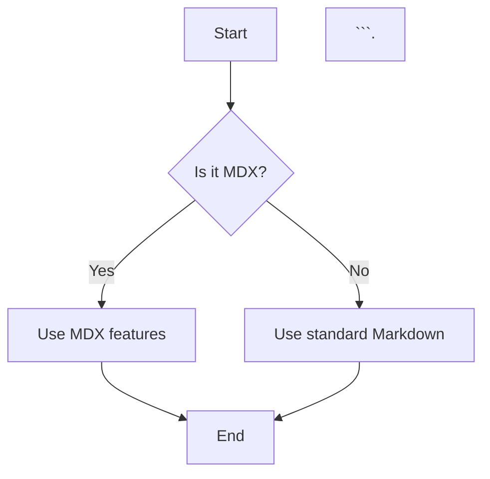
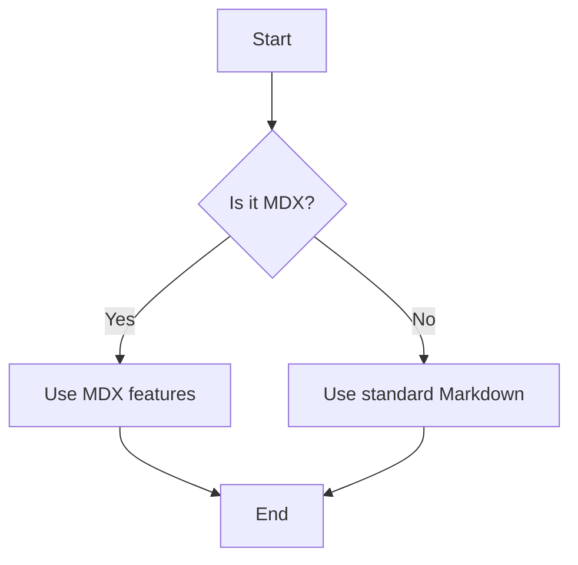

# Getting Started with MDX

This guides serves as a brief introduction to using MDX in your tutorials, for a more comprehensive guide please refer to the [Docusaurus Markdown documentation](https://docusaurus.io/docs/markdown-features).

## What is MDX?

MDX is an extension of Markdown that allows you to include JSX components within your Markdown files. This means you can use React components directly in your documentation, making it more dynamic and interactive.

## Putting it in Practice

Below are a few examples of how to use MDX in your tutorials.

### Adding Notes and Tips

You can use custom components like `:::note`, `:::tip`, and `:::warning` to add notes, tips, and warnings in your tutorials.

```mdx
:::note Note
This is a note example using MDX.
:::
```
This will render as:
:::note Note
This is a note example using MDX.
:::

### Creating Tables

You can create tables using standard Markdown syntax.

```mdx
| Attribute          | Description                                      |
| :---               | :---                                             |
| **Grade Level**    | Any                                              |
| **Estimated Time** | 45 minutes                                       |
```
This will render as:
| Attribute          | Description                                      |
| :---               | :---                                             |
| **Grade Level**    | Any                                              |
| **Estimated Time** | 45 minutes                                       |

### Embedding Links

You can embed links using standard Markdown link syntax.

```mdxmdx
[Intro](/docs/intro)
```
This will render as: [Intro](/docs/intro)

### Diagrams and Flowcharts (using mermaid)

You can include diagrams and flowcharts using Mermaid syntax.

```mdx

This will render as:


### Excercises, Questions & Answers (using html details tag)

You can create collapsible sections for exercises, questions, and answers using the HTML `<details>` tag.

```mdx
<details>
  <summary>Click to expand!</summary>

  Here is the hidden content!
</details>
```
This will render as:

<details>
  <summary>Click to expand!</summary>

  Here is the hidden content!
</details>

### Inline Mathematics (using KaTeX syntax)

You can include inline mathematics using KaTeX syntax.

```mdx
Let $f\colon \R \to \R$ be a function defined by $f(x) = x^2$.
```
This will render as:

Let $f \colon \R \to \R$ be a function defined by $f(x) = x^2$.

## Conclusion

MDX is a powerful tool that allows you to create rich, interactive tutorials by combining Markdown with React components. By using the examples provided in this guide, you can enhance your tutorials and provide a better learning experience for your audience. Happy writing!

Remember, as well, that most of this site is built using MDX, so feel free to explore the source files to see more examples of how MDX can be used effectively!